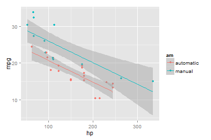
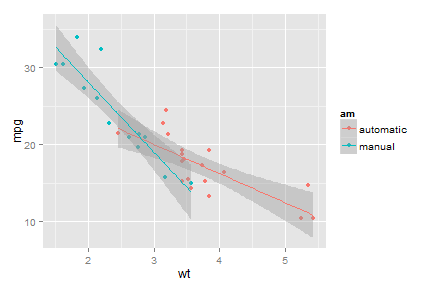

Mtcars Data App Pitch
========================================================
author: Sergey Polgul
date: September 20, 2014

Motivation
========================================================

Use this app to:

- Compare your car's $mpg$ with $mpg$ of vehicles in 1974
- Estimate if your vehicle is substantially different with current technology 
  (more economical or lighter) visually
- Brush up a bit on interpretation of regression models

Another motivational advise:
<small>
"Throwing pebbles into the water, look at the ripples they form on the surface. 
Otherwise this activity will be an empty amusement." 
Kozma Prutkov. <http://en.wikipedia.org/wiki/Kozma_Prutkov>
</small>

Looking at MPG by HP alone
========================================================

 

 - $mpg = 26.58+5.28*I\{"Tran=Manual"\} -0.06*hp+err$
 
 ***
 
 - Does this model accounts for effect of correlation between weight and HP?
 

Looking at MPG by Weight Alone
========================================================

 

 - $mpg = 37.32 -0.02*I\{"Tran=Manual"\} -5.35*wt+err$
 

Statistical Adjustment
============================================

- Adjusting  $hp$ Predictor for $wt$
- <small> $mpg = 34+2.08*I\{"Trans=Manual"\} -2.88*wt -0.04*hp+err$ </small>
- influence of $hp$ dropped from -0.06 to -0.04
- what value for $wt$ do we plug in to return the same values as in model[1]?
- check our app to find out <https://polgy.shinyapps.io/shiny_cars/>
